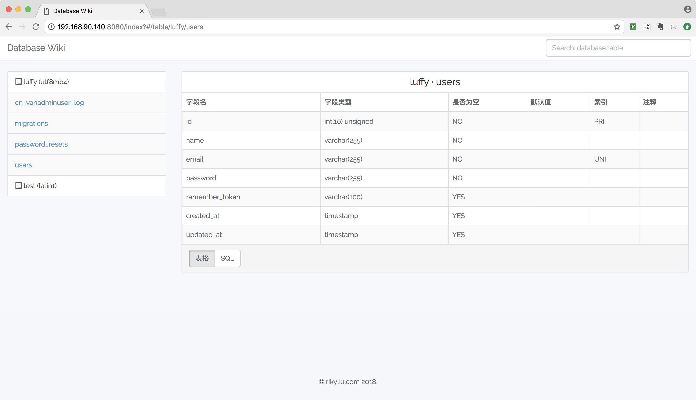

# database-wiki

[](https://travis-ci.org/lxy3372/database-wiki)
[](https://github.com/lxy3372/database-wiki.git)
[](www.php.net)


### 环境要求

- PHP 7.0+
- Laravel 5.3+
- NPM 5.6.0
- VUE 2.0 +

### 安装
```bash
# install dependencies for php
$ composer install --perfer-dist

# copy env
$ cp env.example .env

# generate app key
$ php artisan key:generate

# go into app's directory and install dependencies:
$ cd myproject
$ npm install

# serve with hot reload at localhost:8080.
$ npm run dev

# build for production with minification
$ npm run production


```

### 配置说明

主要配置如下:
```bash
APP_NAME="Database Wiki"  #会显示到页面title
APP_ENV=local
APP_KEY=
APP_DEBUG=true
APP_LOG_LEVEL=debug
APP_URL=http://localhost  #domain

DB_CONNECTION=mysql
DB_HOST=127.0.0.1
DB_PORT=3306
DB_DATABASE=information_schema #这个不能变,考虑再三还是直接查information_schema
DB_USERNAME=homestead
DB_PASSWORD=secret
```

### Screen Shots



### License

Copyright (c) 2018 rikyliu.com

The MIT License (MIT). Please see [Opensource MIT License](http://www.opensource.org/licenses/MIT) for more information.